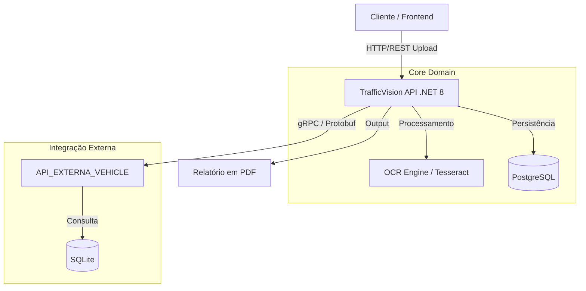

# **TrafficVision**


**TrafficVision** é um sistema distribuído para monitoramento de tráfego e automação de multas/relatórios, facilitando o serviço de agentes de campo. O projeto utiliza **OCR (Reconhecimento Óptico de Caracteres)** para ler placas de veículos em imagens e se comunica via **gRPC** com um serviço externo simulado (Detran) para validar dados e gerar relatórios dinâmicos em PDF.

>  **Status:** MVP Funcional (Validado tecnicamente por parceiros do setor logístico).

---

## Arquitetura do Sistema

O diferencial deste projeto é a fuga do monólito tradicional. A arquitetura foi desenhada para simular um cenário real de alta performance e desacoplamento entre serviços.

### Componentes:
1.  **TrafficVision.Api (Core):** Orquestrador principal construído com **Clean Architecture** e **DDD**. Responsável pelo upload, processamento de OCR e regras de negócio.
2.  **API_EXTERNA_VEHICLE (Microsserviço):** Um servidor isolado que simula a base de dados do Detran.
3.  **Comunicação gRPC:** A troca de dados entre a API Principal e o Microsserviço ocorre via **gRPC (Protobuf)**, garantindo baixa latência e contratos de dados rígidos, simulando comunicação interna de datacenter.



#  Tecnologias Utilizadas
- Backend: C# .NET 8
- Comunicação: gRPC (Google Remote Procedure Call)
- Arquitetura: Clean Architecture (Domain, Application, Infrastructure.Data, API)
- Banco de Dados: PostgreSQL (Principal) e SQLite (Serviço Externo)
- OCR: Tesseract / OpenCvSharp
- Documentação: Swagger / OpenAPI
- Outros: Entity Framework Core, FluentValidation, Mediatr.

# ⚙️ Pré-requisitos e Instalação
Para rodar o ecossistema completo, você precisará rodar tanto este projeto quanto a API Secundária.

1. Dependência Obrigatória (API Secundária)
Este projeto consome dados via gRPC de um serviço externo. Você deve clonar e rodar o repositório abaixo:

- Repositório: [API_EXTERNA_VEHICLE](https://github.com/CarlosLeutcke/API_EXTERNA_VEHICLE)
- Responsável: Carlos Legutcke (Parceiro de Desenvolvimento)

⚠️ Importante: Certifique-se de que a API_EXTERNA_VEHICLE esteja rodando (geralmente na porta https://localhost:7256 ou similar) antes de testar o OCR no TrafficVision.

2. Configurando o TrafficVision (Este Repositório)
Clone o repositório:

``` bash
git clone https://github.com/joseHenrique346/TrafficVision.git
cd TrafficVision
```

Configure o Banco de Dados: No arquivo appsettings.json da TrafficVision.Api, verifique a string de conexão do PostgreSQL.

Restaurar Dependências e Migrations:

``` bash
dotnet restore
dotnet ef database update --project src/TrafficVision.Infrastructure.Data --startup-project src/TrafficVision.Api
```

Configuração do gRPC: Verifique no Program.cs ou appsettings.json se a URL do cliente gRPC aponta para a porta onde a API_EXTERNA_VEHICLE está rodando.

Executar:

``` bash
dotnet run --project src/TrafficVision.Api
```

# Funcionalidades do MVP
[x] Upload de Imagem: Recebimento de imagens de veículos via API REST.

[x] OCR (Leitura de Placa): Processamento da imagem para extração de texto da placa.

[x] Consulta Externa (gRPC): Envio da placa extraída para o microsserviço externo para buscar dados do proprietário e situação do veículo.

[x] Geração de Relatório: Criação dinâmica de um arquivo PDF com os dados extraídos e a validação legal.

# Roadmap e Melhorias Futuras
Como este é um MVP focado na validação da arquitetura distribuída, algumas funcionalidades estão no backlog para a versão 2.0:
- Autenticação/Autorização: Implementação de JWT.
- Refinamento do OCR: Adicionar uma camada de Computer Vision para detectar e recortar a placa automaticamente antes de passar para o OCR (atualmente espera imagens focadas).
- Filas: Implementar RabbitMQ para processamento assíncrono de imagens pesadas.

# 👨‍💻 Autor
### José Henrique Fernandes Desenvolvedor Backend .NET | Focado em Arquitetura de Software e Soluções Corporativas.
- [Linkedin](https://www.linkedin.com/in/jos%C3%A9fernandes346/)

### Projeto desenvolvido como conclusão de 4º termo, validado por especialistas de gestão de tráfego.
